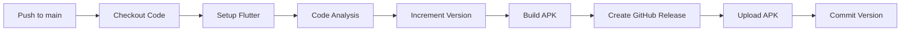

# CI/CD Pipeline Setup Guide

This document explains the automated CI/CD pipeline for QuoteVault Flutter app.

## Overview

The CI/CD pipeline automatically builds and releases your Flutter APK whenever you push or merge changes to the `main` branch.

### What It Does

1. **✅ Code Analysis (CI)** - Runs `flutter analyze` to check for code errors
2. **🔢 Version Bumping** - Automatically increments build number (e.g., `1.0.5+9` → `1.0.5+10`)
3. **📦 APK Build (CD)** - Builds release APK using your specified command
4. **🚀 GitHub Release** - Creates a GitHub Release with the APK attached
5. **💾 Commit** - Commits the version bump back to repository

## How It Works

### Automatic Trigger

The pipeline runs automatically when you:

- Push commits directly to the `main` branch
- Merge a pull request into `main`

### Manual Trigger

You can also trigger the pipeline manually:

1. Go to **Actions** tab in your GitHub repository
2. Select **CI/CD - Build and Release APK** workflow
3. Click **Run workflow** → Select `main` branch → **Run workflow**

## Workflow Steps



### Detailed Process

1. **Checkout Code** - Fetches latest code from repository
2. **Setup Java** - Installs Java 17 (required for Android builds)
3. **Setup Flutter** - Installs Flutter 3.24.0 stable
4. **Run Flutter Analyze** - Checks code for errors and issues
   - ❌ If analysis fails, workflow stops
5. **Increment Build Number** - Automatically bumps build number in `pubspec.yaml`
6. **Build APK** - Executes:
   ```bash
   flutter clean &&
   cd android &&
   ./gradlew clean &&
   cd ../ &&
   flutter pub get &&
   flutter build apk --release
   ```
7. **Create GitHub Release** - Creates a tagged release with:
   - Version tag (e.g., `v1.0.5+10`)
   - Release notes with commit message
   - APK file attached for download
8. **Commit Version Bump** - Commits updated `pubspec.yaml` back to repository

## Version Management

### Current Version Format

```yaml
version: 1.0.5+9
  ─┬─ ─┬─  ─
  │   │   └── Build number (auto-incremented)
  │   └────── Patch version
  └────────── Major.Minor version
```

### Incrementing Build Number

- **Automatic**: Build number increments on every successful build
- **Current**: `1.0.5+9`
- **After build**: `1.0.5+10`

### Changing Version Name

To change the version name (e.g., from `1.0.5` to `1.1.0`):

1. Manually edit `pubspec.yaml`:
   ```yaml
   version: 1.1.0+10 # Keep current build number
   ```
2. Commit and push the change
3. The build number will continue incrementing normally

## Accessing Your Builds

### GitHub Releases

1. Navigate to your repository on GitHub
2. Click **Releases** (right sidebar)
3. Find the latest release (e.g., `v1.0.5+10`)
4. Download the APK file

**Direct URL Format:**

```
https://github.com/YOUR_USERNAME/QuoteVault/releases
```

### APK File Naming

APKs are named with version information:

```
QuoteVault-v1.0.5+10.apk
```

## Sharing the APK

### Option 1: Direct Download Link

Share the release URL:

```
https://github.com/YOUR_USERNAME/QuoteVault/releases/latest
```

### Option 2: Generate QR Code

1. Go to the latest release
2. Right-click the APK download button → Copy link address
3. Generate QR code using a tool like [qr-code-generator.com](https://www.qr-code-generator.com/)
4. Share the QR code

### Option 3: Release Badge

Add a badge to your README:

```markdown
[](https://github.com/YOUR_USERNAME/QuoteVault/releases/latest)
```

## Troubleshooting

### Build Fails on Flutter Analyze

**Problem**: Workflow fails at "Run Flutter Analyze" step

**Solution**:

1. Run `flutter analyze` locally
2. Fix all reported issues
3. Commit and push fixes

### Build Number Not Incrementing

**Problem**: Version number stays the same after build

**Solution**:

1. Check workflow logs in GitHub Actions
2. Ensure `increment_version.sh` script ran successfully
3. Verify the commit step completed

### APK Not Appearing in Release

**Problem**: Release created but APK is missing

**Solution**:

1. Check workflow logs for APK build step
2. Verify the build completed successfully
3. Check if the APK file was created in `build/app/outputs/flutter-apk/`

### Permission Denied for gradlew

**Problem**: Build fails with "Permission denied: ./gradlew"

**Solution**:

1. Make gradlew executable locally:
   ```bash
   chmod +x android/gradlew
   ```
2. Commit and push the change

## Manual Version Increment

If you need to manually increment the version:

```bash
# Make the script executable (one-time)
chmod +x .github/scripts/increment_version.sh

# Run the script
.github/scripts/increment_version.sh

# Commit the change
git add pubspec.yaml
git commit -m "Bump version"
git push
```

## Advanced Configuration

### Changing Flutter Version

Edit `.github/workflows/ci-cd.yml`:

```yaml
- name: Setup Flutter
  uses: subosito/flutter-action@v2
  with:
    flutter-version: "3.27.0" # Change this
    channel: "stable"
```

### Adding Custom Build Flags

Edit the "Build APK" step in `.github/workflows/ci-cd.yml`:

```yaml
- name: Build APK
  run: |
    flutter clean
    cd android
    ./gradlew clean
    cd ../
    flutter pub get
    flutter build apk --release --dart-define=ENV=production
```

### Skip CI on Specific Commits

Add `[skip ci]` to your commit message:

```bash
git commit -m "Update README [skip ci]"
```

This prevents the workflow from running.

## Monitoring Builds

### GitHub Actions Dashboard

1. Go to **Actions** tab in your repository
2. View all workflow runs
3. Click on a run to see detailed logs
4. Green checkmark ✅ = successful build
5. Red X ❌ = failed build

### Email Notifications

GitHub sends email notifications for:

- Failed workflow runs
- Successful builds (if configured in repository settings)

## Security Notes

- The workflow uses `GITHUB_TOKEN` which is automatically provided
- No external secrets or credentials required
- APKs are publicly accessible via GitHub Releases
- Version commits use GitHub Actions bot identity

## Questions?

If you encounter issues not covered here:

1. Check the workflow logs in GitHub Actions
2. Review the error messages carefully
3. Search for similar issues in GitHub discussions

---

**Happy Building! 🚀**
